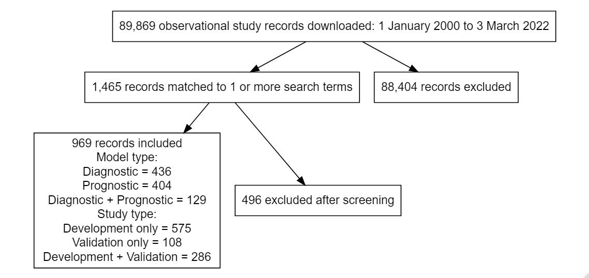
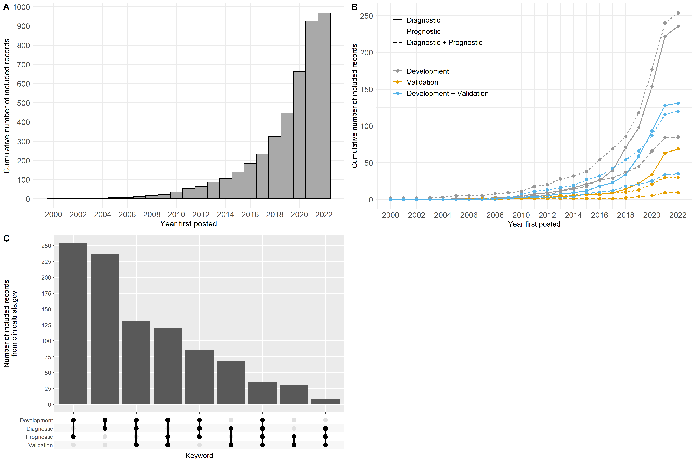
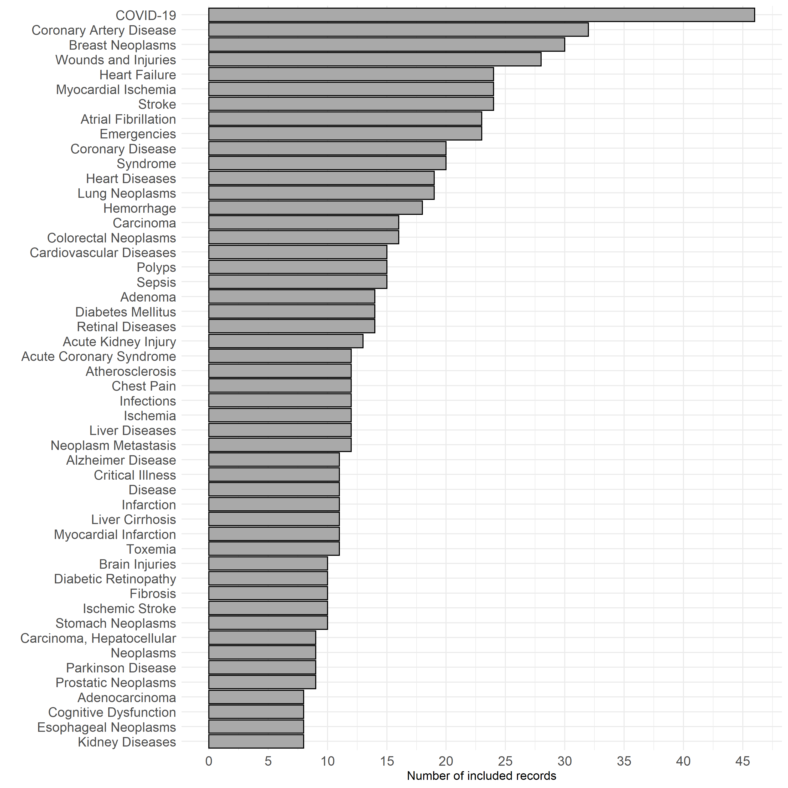
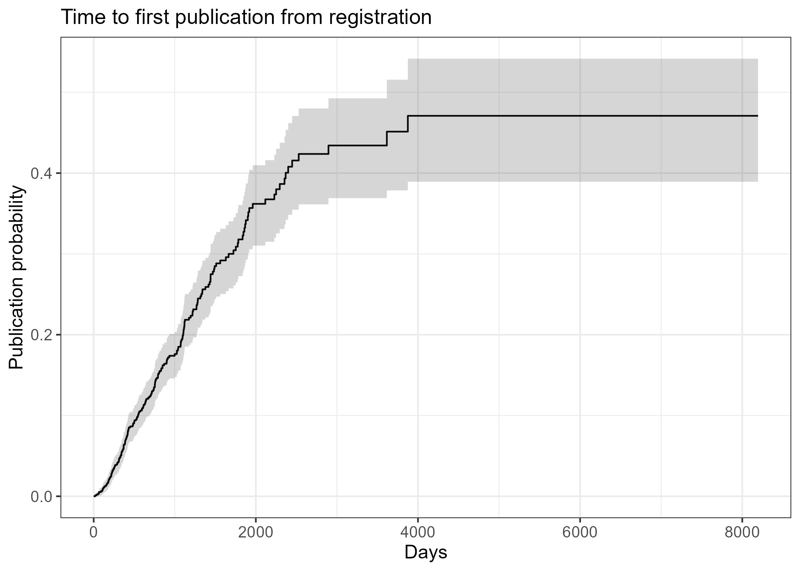

```{r setup, include=FALSE}
knitr::opts_chunk$set(echo = FALSE)
source('99_packages.R')
source('99_functions.R')
```

# Introduction

Accurate patient risk information is a guiding principle of medical decision-making. Patient risk summaries support decision-making by estimating the chances of developing a disease or health condition [ref] or experiencing a future event based on an individual’s current health [ref]. For instance, early knowledge of an individual's increased risk of heart disease may prompt preventative measures to delay or reduce the likelihood of onset [ref]. Conversely, identifying patients at low risk of cancer recurrence may help prioritize high-cost interventions to improve prognosis for vulnerable patients [ref].[shift from population to individual here] Routinely collected data sources, including demographics, medical history, and clinical test results, are often used to infer patient risk. As advances in health technology add to the volume and variety of data available, advances in quantitative methods are also needed to transform these data into reliable and interpretable outputs. Clinical prediction models offer a general framework for risk estimation based on multiple data sources. When successfully validated and implemented, clinical prediction models have the potential to progress the shift from evidence-based to personalized medicine [ref].


Despite their perceived value for personalized medicine, clinical prediction models are a growing source of research waste. Systematic reviews of diagnostic and prognostic prediction models have consistently found that most models are inadequately reported and unsuitable for use in practice [refs]. The Transparent Reporting of a multivariable prediction model for Individual Prognosis or Diagnosis (TRIPOD) statement was introduced in 2015 to help researchers better describe the steps taken to develop, validate and/or update a clinical prediction model [ref]. Related guidelines to assess risk of bias have also been developed [ref]. Whilst the TRIPOD statement has led to modest improvements in conduct and reporting [refs], poor quality models continue to be published [ref]. At the start of the COVID-19 pandemic, a statistician-led systematic review found 20 diagnostic and 10 prognostic models for predicting COVID-19 outcomes [refs]. All models were assessed as being at high risk of bias due to low sample sizes, inappropriate choice of predictors, and inadequate model assessment. By July 2022, the number of published prognostic models had increased to 606, comprising 381 newly developed models and 225 validation studies on existing models. Updated results showed that 90% of models were unsuitable for clinical use. These findings imply that best practices for clinical prediction modelling are being ignored, and errors made during the design stage are major contributors to poor research quality [ref].

Current reviews of clinical prediction models are likely affected by publication bias, as studies that report favourable results are more likely to be submitted and published [ref]. Publication bias severely hinders progress in health and medical research, as the failure to publish "negative" findings inevitably leads to duplicated efforts by other researchers to address the same research question(s). If publication bias exists in the clinical prediction modelling literature, then many more models will have been planned but never completed or published. Approaches to identify planned studies are an opportunity to examine  non-publication and current areas of research focus, including studies aiming to predict the same outcome(s). Early identification of planned studies further presents the opportunity to remedy potential sources of bias, to support improvements in research quality.

Study registries are a useful way to evaluate current research before it is published [ref]. Clinicaltrials.gov is an online study registry launched in 2000 to improve access to information on planned, ongoing and completed clinical studies. Since then, over 420,000 studies have been registered from 221 countries (https://www.clinicaltrials.gov/; last viewed: 8 July 2022). Previous research has analysed data collected by clinicaltrials.gov to assess reporting completeness and outcomes, including non-publication [refs]. In this paper, we analysed registered studies that included the development and/or validation of a clinical prediction model as part of their planned research. Our analysis addressed three objectives. First, we summarised trends in diagnostic and prognostic prediction models registered for all diseases and health conditions. Second, we reviewed reporting of planned versus actual sample sizes, as a common source of bias in published clinical prediction models. Third, we estimated the times to study completion and publication for all included studies. Publication rates were estimated using a validated algorithm for linking clinicaltrials.gov study identifiers to publication records in PubMed [ref].

# Data and Methods

We systematically screened clinicaltrials.gov to identify observational studies that planned to develop a new clinical prediction model or validate an existing model for any disease or health condition. We chose to focus on observational study types only, given the common use of existing datasets in published studies [ref - placeholder txt; could be worded better]. Studies registered on clinicaltrials.gov since 2000 were downloaded for analysis (data downloaded on 3 March 2022). Study records followed a standardised template and were downloaded in XML format. Data were extracted from compulsory fields which covered the disease or condition of interest, planned commencement and end dates, study design, outcomes measures and planned sample size (Table 1). The disease or condition of interest was inferred from study indexing to Medical Subject Heading (MeSH) terms, based on terms included in the XML file. Code written to process the XML data is available on GitHub [link here].

A clinical prediction model was defined as any multivariable model designed to estimate the individual-level risk of a diagnostic or prognostic outcome [ref]. Risk estimates could be summarised as a clinical score, probability, or another model-based estimate such as mean survival time. No restrictions were placed on model data sources or choice of predictor variables, provided variables were defined at the individual level. Predictor variables could therefore take the form of patient-level characteristics (e.g., demographics, clinical parameters) or processed features (e.g., extracted from medical images). Studies could propose a clinical prediction model as the primary study objective, or as an objective within a larger study. Studies that planned to identify or validate independent risk factors without mention of developing a subsequent prediction model were excluded. 

Relevant studies were identified over two stages. Study records were initially screened using targeted keywords (Table 1). Search strategies used by published reviews of clinical prediction models were used to inform the keyword list [refs]. Keywords could appear in any study field [rex - can you pls confirm the final search used]. Matching studies were then manually screened for eligibility using the rayyan application. All studies were independently reviewed by at least two study authors. Decision conflicts were resolved by discussion among three authors (NW, RP, DB).

For the final set of included studies, additional data were extracted on study updates over time. Study updates captured changes to anticipated and actual sample sizes, overall study status and details of resulting publications. 

- rex: can you pls add a sentence or two on the PubMed matching tool.


* Table 1 info: Screening criteria

* Search terms were:"machine learning","artificial intelligence","deep learning",
  "prediction model","predictive model","prediction score","predictive score",
  "warning score","risk score","risk prediction",
  "prognostic model","diagnostic model"


# Results

The first stage of our search strategy returned 1,465 study records, from an initial sample size of 89,869 records (Figure 1). The most frequent keyword matches were [to do - data on RDSS...], which changed/did not change over time (Figure 2A).

After screening, 969 studies were included. Most studies planned model development only (n = 575; 59%) or model development with mention of internal and/or external model validation (n = 286; 30%). Approximately one in ten studies considered the validation of existing prediction models, of which xx were clinical scores or early warning scores [more detail here]. Study types were evenly distributed across diagnostic and prognostic outcomes (Figure 2B). The total number of model development studies increased over time. Large increases in study numbers in later years were attributed to COVID-19 models (check). Or correlated with increases in the mention of deep learning/machine learning/ai.






```{r}
load("data/final_studies.rda")
search_terms <- c("machine learning","artificial intelligence","deep learning","prediction model","predictive model","prediction score","predictive score","warning score","risk score","risk prediction","prognostic model","diagnostic model")

keyword_hits <- function(df,check_fields,varnames){
  df_l <- df %>% select(id)
  for (k in varnames){
    ad <- select(df,all_of(c("id",check_fields))) %>% 
      mutate_at(vars(all_of(check_fields)),~ifelse(grepl(k,.x),1,0)) %>% 
      mutate(!!k := pmin(1,rowSums(select(.,all_of(check_fields))),na.rm=T)) %>%
      select(id,all_of(k))
    
    df_l <- full_join(df_l,ad,by='id')
  }
  
  return(df_l)
} 
scan_fields = c("official_title","brief_title","brief_summary","detailed_summary","keywords","mesh_terms",
                "primary_outcome_measures","primary_outcome_description","secondary_outcome_measures","secondary_outcome_description")

keyword_matches = keyword_hits(df=dat_included,check_fields=scan_fields,varnames=search_terms) %>% gather(keyword,match,-id)

#add year posted
year_posted = dat_included %>% mutate(year = gsub(".*, ","",posted)) %>% select(id,year)
keyword_matches  = inner_join(keyword_matches,year_posted,by='id')
keyword_summary = filter(keyword_matches,match==1) %>% distinct(id,keyword) %>% count(keyword,sort=T)

flextable(keyword_summary) %>% autofit()


```





## Analysis

* Study status; all identified studies, possibly compared with random sample of observational studies that don't return match to search terms?
* Sample size history for final sample
* Frequency of targeted keywords (e.g, (.*)validation, TRIPOD)
* Links to publications using python tool (Rex to lead)


# Discussion

- need to scope existing published models for a given outcome before developing another one! [refs - riley]
- Before embarking on a prediction modelling study, its important to ensure a sufficient sample size is available and that proposed predictors/outcome data collection is of sufficient quality. Just as per any planned statistical analysis. Poor choice will likley lead to poor performance down this line (garbage in = garbage out). ref: https://www.bmj.com/content/338/bmj.b604 (royston2009)

# References