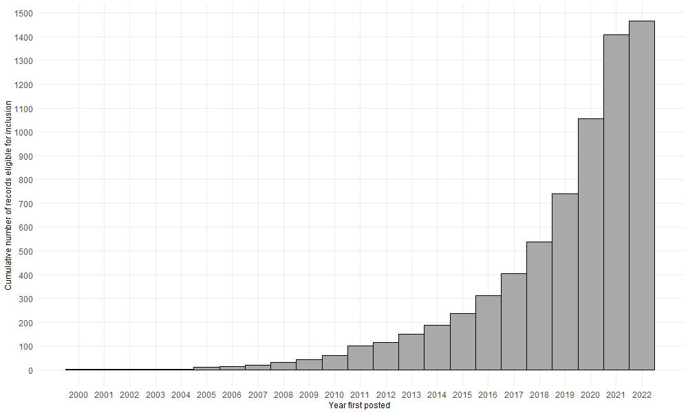

```{r setup, include=FALSE}
knitr::opts_chunk$set(echo = TRUE)
```

# Introduction


Clinical prediction models represent a growing source of research waste, with poorly conducted studies posing risks to the safety and quality of patient care.


* Systematic review of published clinical prediction models have consistently highlighted poor quality, limited applicability in practice. Examples in COVID-19 (BMJ review), oncology (Dhiman 2022), others


* It is likely that many clinical prediction models are planned but never published. Source of research waste.

* One way to assess research waste from non-publication is to follow-up registered studies aiming to develop and/or validate new or already published prediction model (latter is slightly different point - flesh out later)

* Other refs: Evaluating the impact of prediction models: lessons learned, challenges, and recommendations

# Data and Methods

Clinicaltrials.gov is an online database designed to improve access to information about planned, ongoing and completed clinical studies. The database was launched in 2000 by the National Institute of Health’s National Library of Medicine, in response to United States legislation mandating the registration of funded clinical trials. Since then, over 420,000 studies have been registered, comprising both interventional and observational studies from 221 countries (https://www.clinicaltrials.gov/; last viewed: 8 July 2022). 

Study registration is completed by a nominated study investigator using a standardised template. Compulsory fields cover the disease or condition of interest, planned commencement and end dates, study type and study design details including interventions (if any), outcomes measures and planned sample size. Additional information on participant recruitment, funding and regulatory oversight is also required. A statistical analysis plan is not required at the time of registration, but can be included as part of an optional detailed summary. Study records can be updated at any time up until project completion, including providing details of resulting publications.

For this analysis, we identified and analysed outcomes of registered studies that planned to develop or validate a clinical prediction model (data downloaded on 3 March 2022). A clinical prediction model was defined as any multivariable model designed to estimate the individual-level risk of being diagnosed with a single disease or health condition (diagnostic model) or experiencing a future health-related outcome following diagnosis (prognostic model) (@hemingway2013). Future outcomes considered by prognostic models included both pre-defined clinical endpoints, such as treatment response and mortality, and measures of an individual’s health state following diagnosis, such as health-related quality of life. 

All records classified as observational study designs were included. All other study types were excluded [need to provide rationale here for excluding RCTS]. Dependent variables could be defined as a binary, continuous or time-to-event outcome. No restrictions were placed on model data sources or choice of independent variables, provided variables were defined at the individual level and at least two variables were planned for inclusion in the proposed model. This meant that independent variables could take the form of patient-level characteristics (e.g., demographics, clinical parameters) or processed features (e.g, extracted from images).

Eligible studies proposed a clinical prediction model as the primary study objective, or as an objective within a larger study. Studies that planned to identify or validate independent risk factors associated with outcomes without mention of developing a subsequent prediction model were excluded. 

All study records posted on clinicaltrials.gov until 3 March 2022 were downloaded in XML for analysis (n = xxx). Relevant studies were identified over two stages. In the first stage, we scanned study record fields for keywords reflecting approaches to clinical prediction modelling and their application to diagnosis and prognosis (Table here - search terms + fields searched). Matching studies were then manually screened for eligibility using the web application rayyan. All studies were independently reviewed by at least two study authors.

 

* As table: Search terms were:"machine learning","artificial intelligence","deep learning",
  "prediction model","predictive model","prediction score","predictive score",
  "warning score","risk score","risk prediction",
  "prognostic model","diagnostic model"




## Analysis

* Study status; all identified studies, possibly compared with random sample of observational studies that don't return match to search terms?
* Sample size history for final sample
* Frequency of targeted keywords (e.g, (.*)validation, TRIPOD)
* Links to publications using python tool (Rex to lead)

# References