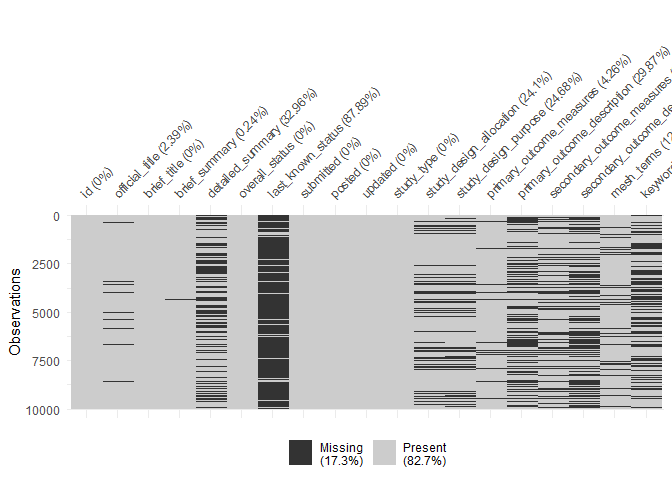
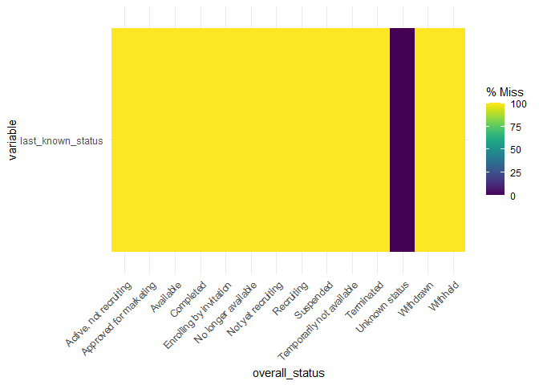
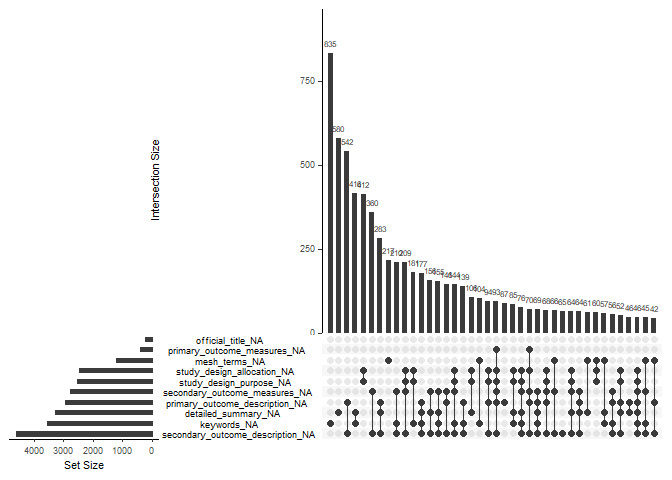
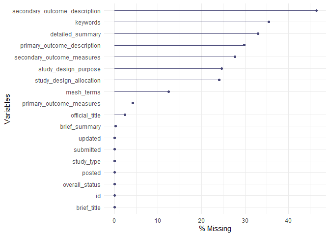
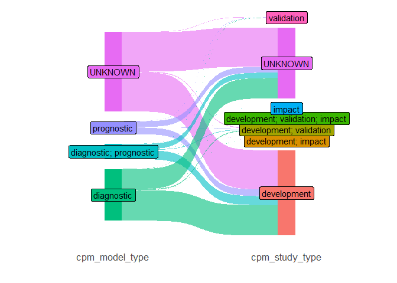

search-strategy
================
Rex Parsons
2022-06-15

``` r
library(tidyverse)
```

    ## ── Attaching packages ─────────────────────────────────────── tidyverse 1.3.1 ──

    ## ✔ ggplot2 3.3.6     ✔ purrr   0.3.4
    ## ✔ tibble  3.1.7     ✔ dplyr   1.0.9
    ## ✔ tidyr   1.2.0     ✔ stringr 1.4.0
    ## ✔ readr   2.1.2     ✔ forcats 0.5.1

    ## ── Conflicts ────────────────────────────────────────── tidyverse_conflicts() ──
    ## ✖ dplyr::filter() masks stats::filter()
    ## ✖ dplyr::lag()    masks stats::lag()

``` r
library(naniar)
```

``` r
load(file='data/all_studies.rda')
```

### list() in `primary_outcome_description` and `secondary_outcome_description` represent missing fields.

They are the content below the outcome measures in the registration.
Here, I clean up the character cols and remove these “list()” before
assessing missingness. Then, since these descriptions appear to only be
more verbose versions of the `[primary/secondary]_outcome_measures`, I
concatenate them together and drop the old column.

``` r
head(dat, 20) %>% 
  select(primary_outcome_measures, primary_outcome_description, 
         secondary_outcome_measures, secondary_outcome_description) %>%
  knitr::kable()
```

| primary_outcome_measures                                                  | primary_outcome_description                                                                                                           | secondary_outcome_measures                                                                                                                                                                                                                                                                                                                                                                                                                                              | secondary_outcome_description |
|:--------------------------------------------------------------------------|:--------------------------------------------------------------------------------------------------------------------------------------|:------------------------------------------------------------------------------------------------------------------------------------------------------------------------------------------------------------------------------------------------------------------------------------------------------------------------------------------------------------------------------------------------------------------------------------------------------------------------|:------------------------------|
|                                                                           |                                                                                                                                       |                                                                                                                                                                                                                                                                                                                                                                                                                                                                         |                               |
| To assess whether patients can mediate an appropriate immune response KLH | list()                                                                                                                                | Tetanus Response                                                                                                                                                                                                                                                                                                                                                                                                                                                        | list()                        |
|                                                                           |                                                                                                                                       |                                                                                                                                                                                                                                                                                                                                                                                                                                                                         |                               |
|                                                                           |                                                                                                                                       |                                                                                                                                                                                                                                                                                                                                                                                                                                                                         |                               |
|                                                                           |                                                                                                                                       |                                                                                                                                                                                                                                                                                                                                                                                                                                                                         |                               |
|                                                                           |                                                                                                                                       |                                                                                                                                                                                                                                                                                                                                                                                                                                                                         |                               |
|                                                                           |                                                                                                                                       |                                                                                                                                                                                                                                                                                                                                                                                                                                                                         |                               |
|                                                                           |                                                                                                                                       |                                                                                                                                                                                                                                                                                                                                                                                                                                                                         |                               |
|                                                                           |                                                                                                                                       |                                                                                                                                                                                                                                                                                                                                                                                                                                                                         |                               |
| Morbidity                                                                 | To determine the best therapeutic regimen, using currently approved drugs, for treatment of relapsed cytomegalovirus (CMV) retinitis. |                                                                                                                                                                                                                                                                                                                                                                                                                                                                         |                               |
|                                                                           |                                                                                                                                       |                                                                                                                                                                                                                                                                                                                                                                                                                                                                         |                               |
|                                                                           |                                                                                                                                       |                                                                                                                                                                                                                                                                                                                                                                                                                                                                         |                               |
|                                                                           |                                                                                                                                       |                                                                                                                                                                                                                                                                                                                                                                                                                                                                         |                               |
|                                                                           |                                                                                                                                       |                                                                                                                                                                                                                                                                                                                                                                                                                                                                         |                               |
|                                                                           |                                                                                                                                       |                                                                                                                                                                                                                                                                                                                                                                                                                                                                         |                               |
|                                                                           |                                                                                                                                       |                                                                                                                                                                                                                                                                                                                                                                                                                                                                         |                               |
|                                                                           |                                                                                                                                       |                                                                                                                                                                                                                                                                                                                                                                                                                                                                         |                               |
|                                                                           |                                                                                                                                       |                                                                                                                                                                                                                                                                                                                                                                                                                                                                         |                               |
| Visual acuity in the amblyopic eye                                        | list()                                                                                                                                | Visual acuity in the amblyopic eye Extended Follow-up: (Primary) To determine the long-term visual acuity outcome at age 10 years and at age 15 years in patients diagnosed with amblyopia before age 7 years Extended Follow-up: To determine whether the long-term visual acuity outcome at age 10 yrs and age 15 yrs differs between patients who received patching followed by best clinical care and patients who received atropine followed by best clinical care | list() list() list()          |
|                                                                           |                                                                                                                                       |                                                                                                                                                                                                                                                                                                                                                                                                                                                                         |                               |

``` r
dat_cleaned <- dat %>%
  mutate(
    across( # remove all the 'list()'s from outcome descriptions
      c("secondary_outcome_description", "primary_outcome_description"),
      function(x) str_remove_all(x, "list\\(\\)")
    ),
    across(where(is.character), str_trim), # remove white space
    across(where(is.character), function(x) ifelse(nchar(x) == 0, NA, x) ) # replace empty character fields with NA
  )

head(dat_cleaned, 20) %>% 
  select(primary_outcome_measures, primary_outcome_description, 
         secondary_outcome_measures, secondary_outcome_description) %>%
  knitr::kable()
```

| primary_outcome_measures                                                  | primary_outcome_description                                                                                                           | secondary_outcome_measures                                                                                                                                                                                                                                                                                                                                                                                                                                              | secondary_outcome_description |
|:--------------------------------------------------------------------------|:--------------------------------------------------------------------------------------------------------------------------------------|:------------------------------------------------------------------------------------------------------------------------------------------------------------------------------------------------------------------------------------------------------------------------------------------------------------------------------------------------------------------------------------------------------------------------------------------------------------------------|:------------------------------|
| NA                                                                        | NA                                                                                                                                    | NA                                                                                                                                                                                                                                                                                                                                                                                                                                                                      | NA                            |
| To assess whether patients can mediate an appropriate immune response KLH | NA                                                                                                                                    | Tetanus Response                                                                                                                                                                                                                                                                                                                                                                                                                                                        | NA                            |
| NA                                                                        | NA                                                                                                                                    | NA                                                                                                                                                                                                                                                                                                                                                                                                                                                                      | NA                            |
| NA                                                                        | NA                                                                                                                                    | NA                                                                                                                                                                                                                                                                                                                                                                                                                                                                      | NA                            |
| NA                                                                        | NA                                                                                                                                    | NA                                                                                                                                                                                                                                                                                                                                                                                                                                                                      | NA                            |
| NA                                                                        | NA                                                                                                                                    | NA                                                                                                                                                                                                                                                                                                                                                                                                                                                                      | NA                            |
| NA                                                                        | NA                                                                                                                                    | NA                                                                                                                                                                                                                                                                                                                                                                                                                                                                      | NA                            |
| NA                                                                        | NA                                                                                                                                    | NA                                                                                                                                                                                                                                                                                                                                                                                                                                                                      | NA                            |
| NA                                                                        | NA                                                                                                                                    | NA                                                                                                                                                                                                                                                                                                                                                                                                                                                                      | NA                            |
| Morbidity                                                                 | To determine the best therapeutic regimen, using currently approved drugs, for treatment of relapsed cytomegalovirus (CMV) retinitis. | NA                                                                                                                                                                                                                                                                                                                                                                                                                                                                      | NA                            |
| NA                                                                        | NA                                                                                                                                    | NA                                                                                                                                                                                                                                                                                                                                                                                                                                                                      | NA                            |
| NA                                                                        | NA                                                                                                                                    | NA                                                                                                                                                                                                                                                                                                                                                                                                                                                                      | NA                            |
| NA                                                                        | NA                                                                                                                                    | NA                                                                                                                                                                                                                                                                                                                                                                                                                                                                      | NA                            |
| NA                                                                        | NA                                                                                                                                    | NA                                                                                                                                                                                                                                                                                                                                                                                                                                                                      | NA                            |
| NA                                                                        | NA                                                                                                                                    | NA                                                                                                                                                                                                                                                                                                                                                                                                                                                                      | NA                            |
| NA                                                                        | NA                                                                                                                                    | NA                                                                                                                                                                                                                                                                                                                                                                                                                                                                      | NA                            |
| NA                                                                        | NA                                                                                                                                    | NA                                                                                                                                                                                                                                                                                                                                                                                                                                                                      | NA                            |
| NA                                                                        | NA                                                                                                                                    | NA                                                                                                                                                                                                                                                                                                                                                                                                                                                                      | NA                            |
| Visual acuity in the amblyopic eye                                        | NA                                                                                                                                    | Visual acuity in the amblyopic eye Extended Follow-up: (Primary) To determine the long-term visual acuity outcome at age 10 years and at age 15 years in patients diagnosed with amblyopia before age 7 years Extended Follow-up: To determine whether the long-term visual acuity outcome at age 10 yrs and age 15 yrs differs between patients who received patching followed by best clinical care and patients who received atropine followed by best clinical care | NA                            |
| NA                                                                        | NA                                                                                                                                    | NA                                                                                                                                                                                                                                                                                                                                                                                                                                                                      | NA                            |

# visualise the missingness

``` r
n_sample <- 10000
df_sample <- dat_cleaned[sample(1:nrow(dat_cleaned), size=n_sample, replace=FALSE), ]
```

Lots of missingness in `last_known_status`. This variable is only ever
complete when `overall_status == "Unknown status"`

``` r
vis_miss(df_sample)
```

    ## Warning: `gather_()` was deprecated in tidyr 1.2.0.
    ## Please use `gather()` instead.
    ## This warning is displayed once every 8 hours.
    ## Call `lifecycle::last_lifecycle_warnings()` to see where this warning was generated.

<!-- -->

``` r
gg_miss_fct(x = select(df_sample, overall_status, last_known_status), fct = overall_status)
```

<!-- -->

Other vars with relatively high amounts of missingness (ignoring
`[primary/secondary]_outcome_description`) include:

-   keywords
-   detailed_summary
-   study_design_purpose
-   study_design_allocation

``` r
df_sample2 <- select(df_sample, -last_known_status)
gg_miss_upset(df_sample2, nsets=10)
```

<!-- -->

``` r
gg_miss_var(df_sample2, show_pct = TRUE)
```

    ## Warning: It is deprecated to specify `guide = FALSE` to remove a guide. Please
    ## use `guide = "none"` instead.

<!-- -->

# Experiment with some search-strategies

Concatenate outcome descriptions to measures, and drop the descriptions
cols

``` r
# n_sample <- 1000
# dat_search <- dat_cleaned[sample(1:nrow(dat_cleaned), size=n_sample, replace=FALSE), ] 
dat_search <- dat_cleaned # don't use sample sample later


dat_search2 <- dat_search %>%
  # concatenate primary and secondary outcome measures and descriptions
  mutate(
    across(
      c("primary_outcome_measures", "primary_outcome_description",
        "secondary_outcome_measures", "secondary_outcome_description"),
      ~replace_na(., "")
    ),
    primary_outcome = str_c(primary_outcome_measures, '; ', primary_outcome_description),
    secondary_outcome = str_c(secondary_outcome_measures, '; ', secondary_outcome_description)
  ) %>%
  select(
    -c("primary_outcome_measures", "primary_outcome_description",
       "secondary_outcome_measures", "secondary_outcome_description")
  ) %>%
  # concatenate official_title with brief_title, and brief_summary with detailed_summary
  mutate(
    across(
      c("official_title", "brief_title",
        "brief_summary", "detailed_summary"),
      ~replace_na(., "")
    ),
    title=str_c(official_title, '; ', brief_title),
    summary=str_c(brief_summary, '; ', detailed_summary)
  ) %>%
  select(
    -c("official_title", "brief_title",
       "brief_summary", "detailed_summary")
  )
```

# functions to apply search strategies

``` r
to_lower_all <- function(data, apply=TRUE) {
  if(apply) {
    data %>% 
      mutate(across(everything(), tolower))
  } else {
    data
  }
}

fx_check_regex <- function(data, cols, pattern, indicator_colname, apply_to_lower=TRUE) {
  match_vec <- data %>%
    select(all_of(cols)) %>%
    to_lower_all(., apply=apply_to_lower) %>%
    mutate(across(
      cols, 
      function(x) str_detect(x, pattern=pattern)
      )) %>%
    rowSums > 0
  
  if(indicator_colname %in% names(data)) {
    data[[indicator_colname]] <- (data[[indicator_colname]] + match_vec) > 0
  } else {
    data[[indicator_colname]] <- match_vec > 0
  }
  data
}

# test example to show that piping and updating existing 'indicator_column' works
example_df <- data.frame(
  abstract = c("chest pain", "Chest pain", "angina", "prediction model"),
  title = c("test1", "test2", "chest pain in ...", "angina")
)

# example_df %>%
#   fx_check_regex(cols="abstract", pattern="chest pain", apply_to_lower = FALSE, indicator_colname = "heart_disease")
# 
# example_df %>%
#   fx_check_regex(cols="abstract", pattern="chest pain", indicator_colname = "heart_disease")
# 
# example_df %>%
#   fx_check_regex(cols=c("abstract", "title"), pattern="chest pain", indicator_colname = "heart_disease")
# 
# example_df %>%
#   fx_check_regex(cols=c("abstract", "title"), pattern="angina", indicator_colname = "heart_disease")

example_df %>%
  fx_check_regex(cols=c("abstract", "title"), pattern="angina", indicator_colname = "heart_disease") %>%
  fx_check_regex(cols=c("abstract", "title"), pattern="chest pain", indicator_colname = "heart_disease") %>%
  fx_check_regex(cols=c("abstract", "title"), pattern="prediction model", indicator_colname = "clinical_prediction_model") %>%
  mutate(include=heart_disease & clinical_prediction_model)
```

    ## Note: Using an external vector in selections is ambiguous.
    ## ℹ Use `all_of(cols)` instead of `cols` to silence this message.
    ## ℹ See <https://tidyselect.r-lib.org/reference/faq-external-vector.html>.
    ## This message is displayed once per session.

    ##           abstract             title heart_disease clinical_prediction_model
    ## 1       chest pain             test1          TRUE                     FALSE
    ## 2       Chest pain             test2          TRUE                     FALSE
    ## 3           angina chest pain in ...          TRUE                     FALSE
    ## 4 prediction model            angina          TRUE                      TRUE
    ##   include
    ## 1   FALSE
    ## 2   FALSE
    ## 3   FALSE
    ## 4    TRUE

search cols:

-   summary
-   title
-   primary_outcome
-   secondary_outcome

target approx n=1000 included studies = 0.25%

``` r
# n_sample <- 100000
# dat_search3 <- dat_search2[sample(1:nrow(dat_search2), size=n_sample, replace=F),]
dat_search3 <- dat_search2
# head(dat_search3)

all_cols <- c("summary", "title", "primary_outcome", "secondary_outcome")

dat_search_results <- 
  dat_search3 %>% 
  fx_check_regex(cols=all_cols, pattern="prediction model", indicator_colname = "cpm") %>% 
  fx_check_regex(cols=all_cols, pattern="risk score", indicator_colname = "cpm") %>% 
  fx_check_regex(cols=all_cols, pattern="prognostic model", indicator_colname = "cpm") %>%
  fx_check_regex(cols=all_cols, pattern="diagnostic model", indicator_colname = "cpm") %>%
  mutate(include=cpm) %>%
  filter(include==TRUE) 

dat_search_results %>%
  summarize(
    included_n = sum(include==TRUE),
    included_perc = scales::percent(included_n/nrow(dat_search3), accuracy=0.01)
  )
```

    ##   included_n included_perc
    ## 1       2048         0.50%

``` r
write.csv(dat_search_results, "data/included_studies.csv", row.names=FALSE)
```

Try search strings from Nicole

``` r
prediction_model_terms <- c(
  "machine learning","artificial intelligence","deep learning",
  "prediction model","predictive model","prediction score","predictive score",
  "warning score","risk score","risk prediction",
  "prognostic model","diagnostic model"
) %>% 
  str_c(collapse='|')

diagnostic_terms <- c("diagnose","diagnosis","diagnostic") %>% 
  str_c(collapse='|')

prognostic_terms <- c("prognosis","prognostic") %>% 
  str_c(collapse='|')

df_matches <- 
  dat_search3 %>% 
  fx_check_regex(cols=all_cols, pattern=prediction_model_terms, indicator_colname="cpm") %>%
  fx_check_regex(cols=all_cols, pattern=diagnostic_terms, indicator_colname="cpm_type_diagnostic") %>%
  fx_check_regex(cols=all_cols, pattern=prognostic_terms, indicator_colname="cpm_type_prognostic") %>%
  fx_check_regex(cols=all_cols, pattern="develo[a-z]*", indicator_colname="study_type_development") %>%
  fx_check_regex(cols=all_cols, pattern="externa[a-z]* validat[a-z]*", indicator_colname="study_type_validation") %>%
  fx_check_regex(cols=all_cols, pattern="impact study", indicator_colname="study_type_impact")


df_matches2 <- 
  df_matches %>%
  select(id, starts_with("cpm_type")) %>%
  pivot_longer(starts_with("cpm_type"), names_transform = function(x) str_remove(x, "cpm_type_")) %>%
  filter(value) %>%
  group_by(id) %>%
  summarize(cpm_model_type = paste0(name, collapse="; ")) %>%
  left_join(select(df_matches, id, cpm), .)
```

    ## Joining, by = "id"

``` r
df_matches3 <- 
  df_matches %>%
  select(id, starts_with("study_type_")) %>%
  pivot_longer(starts_with("study_type_"), names_transform = function(x) str_remove(x, "study_type_")) %>%
  filter(value) %>%
  group_by(id) %>%
  summarize(cpm_study_type = paste0(name, collapse="; ")) %>%
  left_join(select(df_matches2, id, cpm, cpm_model_type), .) 
```

    ## Joining, by = "id"

``` r
write.csv(df_matches3, "data/study_groupings.csv", row.names=F)
```

## Sankey plot

note: might swap to geom_flow() if we think percentages would be useful
<https://stackoverflow.com/questions/64146971/sankey-alluvial-diagram-with-percentage-and-partial-fill-in-r>

``` r
library(ggsankey)
df_matches3 %>%
  filter(cpm) %>%
  mutate(across(everything(), function(x) ifelse(is.na(x), "UNKNOWN", x) )) %>%
  make_long(cpm_model_type,cpm_study_type) %>%
  ggplot(aes(
    x=x, next_x=next_x, node=node, next_node=next_node, 
    fill=factor(node),label = node
  )) +
  geom_sankey(flow.alpha = 0.6) +
  geom_sankey_label() +
  theme_sankey(base_size = 16) +
  theme(legend.position = "none") +
  labs(x="")
```

<!-- -->

### Check the proportion that mention “development” vs “external validation” vs “impact study”

``` r
dat_categories <- 
  dat_search_results %>%
  fx_check_regex(cols=all_cols, pattern="develo[a-z]*", indicator_colname = "development") %>% 
  fx_check_regex(cols=all_cols, pattern="externa[a-z]* validat[a-z]*", indicator_colname = "validation") %>% 
  fx_check_regex(cols=all_cols, pattern="impact study", indicator_colname = "impact") 

dat_categories %>%
  select(id, development:impact) %>%
  pivot_longer(!id) %>%
  filter(value) %>%
  group_by(id) %>%
  summarize(type=paste0(name, collapse="; ")) %>%
  left_join(select(dat_categories, id), .) %>%
  plyr::count("type")
```

    ## Joining, by = "id"

    ##                      type freq
    ## 1             development 1050
    ## 2     development; impact    1
    ## 3 development; validation   45
    ## 4              validation   11
    ## 5                    <NA>  941
